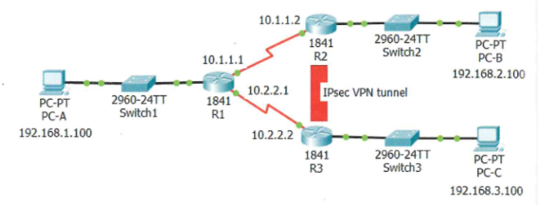

# VPN SITE-TO-SITE

## **Rete utilizzata**



## **Routing tables**

| Apparato | Interfaccia               |            Indirizzo IP             |                     Subnet Mark                     |  Default Gateway  |
| :------: | :------------------------ | :---------------------------------: | :-------------------------------------------------: | :---------------: |
|    R1    | FE0/0<br>S0/0/0<br>S0/0/1 | 192.168.1.1<br>10.1.1.1<br>10.2.2.1 | 255.255.255.0<br>255.255.255.252<br>255.255.255.252 | N/A<br>N/A<br>N/A |
|    R2    | FE0/0<br>S0/0/0 (DCE)     |       192.168.2.1<br>10.1.1.2       |          255.255.255.0<br>255.255.255.252           |    N/A<br>N/A     |
|    R3    | FE0/0<br>S0/0/1 (DCE)     |       192.168.3.1<br>10.2.2.2       |          255.255.255.0<br>255.255.255.252           |    N/A<br>N/A     |
|   PC-A   | NIC                       |            192.168.1.100            |                    255.255.255.0                    |    192.168.1.1    |
|   PC-B   | NIC                       |            192.168.2.100            |                    255.255.255.0                    |    192.168.2.1    |
|   PC-C   | NIC                       |            192.168.3.100            |                    255.255.255.0                    |    192.168.3.1    |

<br>

## **Esecuzione**

### fase 1

Montiamo la rete ed impostiamo le rotte dei router

### fase 2

Dobbiamo verificare che i PC-B e PC-C siano in grado di comunicare a vicenda

-   Dalla console del PC-B:

```
ping 192.168.3.100
```

### fase 3

Controlliamo le versioni dell'ISAKMP definite nei router 2 e 3 con il seguente comando

-   show crypto isakmp default policy

> ISAKMP (Internet Security Association and Key Management Protocol) è il protocollo IKE usato per creare le Secuirity Association (SA o tunnel VPN) e per lo scambio delle chiavi;

### _fase 4_

Configuriamo i parametri IPsec nel router 2

1. abilitiamo il Package Security Technology dal terminale di configurazione

    ```
    license boot module c 1900 technology-package securityk9
    ```

    e si risponde "yes" alla richiesta che viene effettuata

2. salviamo le configurazioni e ricarichiamo il router in modo da poter abilitare la libreria

    ```
    copy running-config startup-config
    reload
    ```

3. verifichiamo che la libreria sia stata abilitata utilizzando il comando `show visual`

4. creiamo una ACL per definire la VPN site-to-site in modo da definire i traffici da mantenere (tutti gli altri sono negati dalla regola default `deny all`), dal terminale di configurazione

    ```
    access-list 120 permit ip 192.168.2.0 0.0.0.255 192.168.3.0 0.0.0.255
    ```

    > ACL è l'acronimo di Access Control List e, nel nostro caso, definiscono il traffico che dovrà essere trattato con IPsec

5. definiamo i parametri da usare per configurare una nuova ISAKMP policy

    definiamo la policy e le assegnamo un numero

    ```
    crypto isakmp policy 1
    ```

    algoritmo di cifratura utilizzato: AES con chiave a 256 bit

    ```
    encryption aes 256
    ```

    metodo di autetincazione: pre-share

    ```
    authentication pre-share
    group 5
    exit
    ```

    configuriamo la chiave di crittografia condivisa con il router 3 (pre-shared key)

    ```
    crypto isakmp key vpnpw1 address 10.2.2.2
    ```

6. configuriamo i parametri di policy per la IPsec SA

    1. definiamo il transform set che fa uso del protocollo ESP con gli algoritmi di cifratura AES (simmetrico) e di autenticazione SHA.

        ```
        crypto ipsec transform-set VPN-SET esp-aes esp-sha-hmac
        ```

        > transform-set: combinazione di diversi protocolli per la sicurezza e di algoritmi

    2. creiamo una nuova VPN-MAP

        ```
        crypto VPN-MAP 10 ipsec-isakmp
        description VPN connection to R3
        set peer 10.2.2.2
        set transform-set VPN-SET
        match address 120
        exit
        ```

        > crypto map: è il comando usato per creare nuova ogni qualvolta si crea un tunnel VPN, esso contiene i parametri negoziati fra i due peer (nel nostro caso i router) coinvolti nella comunicazione IPsec.

    3. applichiamo la crypto map all'interfaccia di uscita (la seriale s0/0/0) del router 2 con il comando `crypto map VPN-MAP`

    4. verifichiamo la policy ISAKMP con il comando `show crypto isakmp policy` e la crypto map con il comando `show crypto map`

### _fase 6_

Configuriamo i parametri IPsec nel router 3 come è stato fatto nel router 2 (fase 5).

### _fase 7_

Verifichiamo il funzionamento del tunnel IPsec VPN appena creato fra i due peer.

Per far ciò faremo inviare dei pacchetti dal router 2 e verificheremo il traffico in entrata ed uscita dalla VPN tramite il comando `show crypto ipsec sa`, nella sezione antecedente all'abilitazione della console.

Quindi, inviamo dei pacchetti dal PC-B al PC-A e verifichiamo se questi ultimi abbiano transitato nella VPN utilizzando il comando precedentemente citato.
