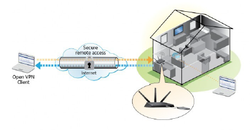
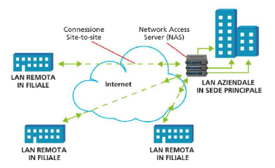
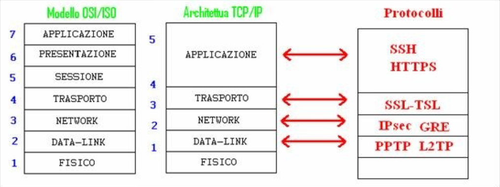

# Legenda

- [Introduzione](#VPN)
- [tipologie di VPN](#tipologie-di-VPN)
  - [Remote Access VPN](#Remote-Access-VPN)
  - [Site-to-Site VPN](#Site-to-Site-VPN)
- [Sicurezza nelle VPN](#Sicurezza-nelle-VPN)
- [Protocolli per reti VPN](#Protocolli-per-reti-VPN)
- [Protocollo IPsec](#Protocollo-IPsec)
  - [Security Association](#Security-Association)
  - [Modalità di trasporto e di tunnel](#modalità-di-trasporto-e-di-tunnel)
    - [Modalità ESP](#Modalità-ESP)
    - [Modalità AH](#Modalità-AH)

# **VPN**

Una VPN, acronimo di Virtual Private Network, è una rete privata creata all'interno di un'infrastruttura pubblica, internet nel quale possiamo creare i collegamenti, al fine di poter realizzare l'homeworking ed il teleworking in totale sicurezza.

- **homeworking:** tipologia di lavoro nella quale un utente può collegarsi da casa ad una rete aziendale come se fosse fisicamente connesso a quest'ultima.
  - _es. connessione, da casa, alla rete del proprio ufficio tramite una VPN_
- **teleworking:** tipologia di lavoro che permette di connettersi alla rete aziendale da qualsiasi luogo tramite il proprio dispositivo mobile.

## vantaggi

- larghezza di banda sempre disponibile
- nessun problema di accesso
- nessuna congestione (intastamento) del traffico, a livello di rete
- prestazioni garantite
- sicurezza garantita

## svantaggi

- alti costi di installazione
- costi ricorrenti di manutenzione
- lunghi tempi per la configurazione e la riconfigurazione
- mancanza di scalabilità
- rischio di blocco della rete in caso di grave guasto su un canale

---

## **tipologie di VPN**

### _Remote Access VPN_

In questo tipo di VPN un client instaura una connessione con il server (client-to-LAN).
Una VPN può essere installata:

- con un NAS  
    

  > NAS è un acronimo di Network Access Server, un server dedicato, od un processo di un server condiviso, alla gestione degli accessi di client esterni alla propria rete.

  Il NAS verifica le credenziali inserite dal client che vuole accedere alla VPN tramite un proprio sistema di autenticazione oppure utilizzando un sistema di autenticazione separato (Server AAA).

  > AAA :
  >
  > - Authentication -> chi sei?
  > - Authorization -> cosa ti è permesso di fare
  > - Accounting -> tracciamento fino al logout

- con un software VPN client  
    

  I sistemi operativi sono dotati di software nativi che permettono ai dispositivi di connettersi ad una VPN remote-access, occorre dunque che nella rete VPN venga configurato il firewall in modo da poter formire una barriera fra la LAN ed internet. Un'alternativa ai software nativi del SO sono i software di privati come OpenVPN, NordVPN, GhostVPN, Surfshark, etc.

### _Site-to-Site VPN_

  

Permette una connessione sicura tra sedi diverse, ognugna con la propria LAN (LAN-to-LAN).
 
Ne esistono di due tipi:

- nelle internet based VPN vengono collegate più LAN di una stessa azienda. _es. sedi diverse_
- nelle extranet based VPN vengono collegate delle LAN di aziende diverse, volte a collaborare.

---

## **Sicurezza nelle VPN**

Dato che i collegamenti VPN vengono creati su internet, una rete pubblica ed accessibile a tutti nella quale i pacchetti si possono intercettare, devono essere utilizzati dei protocolli adatti a mantenere le nostre connessioni private, sicure e logicamente separate dal resto della rete mondiale, come se si trattasse di una linea privata.  

La sicurezza di un collegamento VPN viene garantita tramite:

- autenticazione dell'identità:  
  processo in cui un sistema informatico, un applicativo od un utente verifica la corretta identità di un altro sistema informatico, applicativo o utente che ha intenzione di comunicare attraverso una connessione, al fine di concedergli l'autorizzazione a usufruire dei relativi servizi associati.

  - autorizzazione a più fattori (multi-factor authentication o MFA):  
    dopo il login, effettuato fornendo la coppia username - password al sistema al quale si vuole accedere, viene chiesto all'utente un codice tramite chiave elettronica che cambia ogni volta (OTP -> one-time password, impronta digitale, QR Code, etc).

- accounting:  
  insieme di procedimenti atti a misurare le risorse concesse ad un utente durante l'accesso, il quantitativo di traffico in entrata ed in uscita durante una sua sessione di lavoro e la durata della sessione di lavoro.

- confidenzialità dei dati tramite cifratura (o crittografia):  
  questa può essere effettuata facendo uso degli algoritmi di crittografia asimmetrica (AES, 3DES, Idea, etc). Le chiavi utilizzate da questi algoritmi vengono scambiate attraverso dei protocolli di sicurezza come l'**IKE** (_Internet Key Exchange_).
- tunneling:  
  processo che incapsula il pacchetto di dati all’interno di un altro pacchetto che viene spedito sulla rete al fine di proteggerlo in internet. Ovvero, i dati vengono imbustati due volte per far si che essi siano trasmessi solamente ai destinatari finali autorizzati.
    Questo avviene tramite due modalità: transport mode e tunnel mode.

---

## **Protocolli per reti VPN**

  
È possibile realizzare una VPN su ogni livello della pila OSI e la scelta che induce a scegliere un protocollo piuttosto che un altro dipende dai requisiti di sicurezza dei quali necessita l'utente che deve decidere a che livello della pila realizzare la VPN.  
Tutti i protocolli implementano meccanismi di cifratura e tunneling che incapsulano il pacchetto di dati creandogli attorno una protezione durante la trasmissione e lo de-incapsulano alla ricezione.

## **Protocollo IPsec**

Fra tutti i protocolli VPN, il più sicuro e completo è il protocollo **IPsec** (IP secuirity), un protocollo che agisce nel livello di rete (il 3o) della pila OSI.
Agendo al livello di rete, il protocollo IPsec è in grado di crittografare i _datagram IP_ che contengono i dati che vogliamo mantenere segreti (possano essere UDP, TCP, ICMP) e l'header nel quale vengono indicati il mittente ed il destinatario del pacchetto.  
Dunque possiamo dire che il protocollo IPsec assicura:

- confidenzialità dei dati
- confidenzialità delle parti coinvolte nel flusso di traffico
- integrità dei dati
- autenticazione del mittente

Per far ciò l'IPsec può servirsi del protocollo **AH** (_Authentication Header_) o del protocollo **ESP** (_Encapsulating Security Payload_): il primo fornisce l'autenticazione del mittente e l'integrità dei dati, il secondo fornsice anche la segretezza di questi ultimi; ciò lo rende più complicato ed elaborato del protocollo AH.  
Prima di inviare datagram sicuri nel canale utilizzando uno dei protocolli citati, l'host sorgente e quello di destinazione si devono scambiare un handshake creando una connessione logica sullo strato di rete; questo canale logico è detto **SA** (_Security Association_).

### _Security Association_

La connessione logica definita da un SA è una connessione simplex, cioè unidirezionale.

> Se entrambi gli host volessero scambiarsi datagram sicuri dovrebbero essere stabilite due connessioni SA, una in ciascuna direzione.

Una SA è identificata da:

- un identificatore del protocollo di sicurezza (AH o ESP)
- l'indirizzo IP di destinazione della connessione simplex
- un **SPI** (_Security Parameter Index_), detto indice dei parametri di sicurezza, è un identificatore a 32 bit della connessione

  > Per ogni SA ciascun datagram IPSec avrà un campo speciale per il SPI. In questo campo tutti i datagram di quella SA useranno lo stesso valore SPI.

Per un buon funzionamento di IPsec è necessario uno schema SA automatico che si occupi della gestione delle chiavi; per fare questo ci sono due protocolli principalmente utilizzati:

- il protocollo **ISAKMP** (_Internet Security Association & Key Management Protocol_) il quale definisce le procedure per stabilire e interrompere le SA.
  Esso prevede due fasi:
  1. fase in cui gli end-points della comunicazione siautenticano e si accordano su un insieme di funzioni crittografiche per lo scambio
     dei dati;
  2. fase in cui avviene lo scambio vero e proprio delle SA.
- il protocollo **IKE** (_Intenet Key Exchange_)

## Modalità di trasporto e di tunnel

IPSec può essere utilizzato in due modalità: trasporto e tunnel. Nella modalità trasporto, i dati relativi al protocollo IPSec sono inseriti nel datagram IP, tra l’header IP e quello subito superiore (solitamente TCP o UDP). Questo tipo di soluzione può essere necessaria nel caso di comunicazioni end-to-end. In tutti gli altri casi è obbligatorio utilizzare la modalità tunnel. In questo caso il pacchetto IP viene inglobato in quello IPSec al quale, a sua volta, viene aggiunto un nuovo header IP con gli indirizzi dei security gateways che stanno ai due capi del tunnel.  
  
Da questa immagine si vede chiaramente come i campi dell’header IP non siano assolutamente protetti nel caso di modalità trasporto, mentre la protezione è totale per quanto riguarda la modalità tunnel.

### Modalità ESP

- modalità di trasporto:  
  L’header del pacchetto IP originale subisce una modifica nel campo _next protocol_ nel quale viene inserito il valore 50 per indicare che il datagram sta incapsulando un’intestazione ESP. Quando l’host di destinazione riceve il datagram IP, esso si accorge del valore 50 presente nel campo protocollo ed elabora il datagram usando il protocollo ESP.
  In questa modalità, l'ESP agisce sul payload del pacchetto IP originale, garantendone l'autenticità, la segretezza e l'integrità.  
  La struttra del pacchetto è la seguente:

  - Intestazione IP
    - Intestazione ESP
      - Intestazione payload _es. intestazione TCP_
      - Dati
    - Coda ESP
    - Auth ESP

  Verranno criptati l'intestazione payload, i dati e la coda ESP ed autenticati questi ultimi assieme all'intestazione ESP.

- modalità tunnel:  
  in questa modalità, l'intero datagram IP originale viene incapsulato dentro ad un ESP che a sua volta viene circondato da un nuovo pacchetto IP; così facendo si protegge anche l'intestazione IP originale tramite l'ESP, nascondendo dunque i dati relativi al mittente ed al destinatario.  
  La struttura del pacchetto è la seguente:

- Nuova intestazione IP

  - Intestazione ESP
    - Intestazione IP originale
      - Intestazione payload _es. intestazione TCP_
      - Dati
  - Coda ESP
  - Auth ESP

  Rispetto alla transport mode, viene criptata ed autenticata anche l'intestazione del datagram IP originale.

### Modalità AH

- modalità di trasporto:  
  così come avveniva per ESP, è necessario indicare il valore 51 nel campo _next header_ del datagram IP originario, per indicare che il datagram contiene un pacchetto AH. Quando l’host di destinazione, ricevuto il datagram IP, vede il valore 51, elabora il datagram usando tale protocollo.  
  La struttra del pacchetto è la seguente:

  - Intestazione IP
    - Intestazione AH
      - Intestazione payload _es. intestazione TCP_
      - Dati

  Qui viene autenticato tutto, eccetto i campi mutabili dell'intestazione IP.

- modalità tunnel:  
  come con i pacchetti inviati nella tunnel mode facendo uso del protocollo ESP, il pacchetto IP viene incapsulato in un altro pacchetto IP; così facendo garantiamo l'autenticità, tramite l'AH, del mittente, oltre che dei dati.  
  La struttra del pacchetto è la seguente:

  - Nuova intestazione IP
    - Intestazione AH
      - Intestazione IP originale
      - Intestazione payload _es. intestazione TCP_
      - Dati
